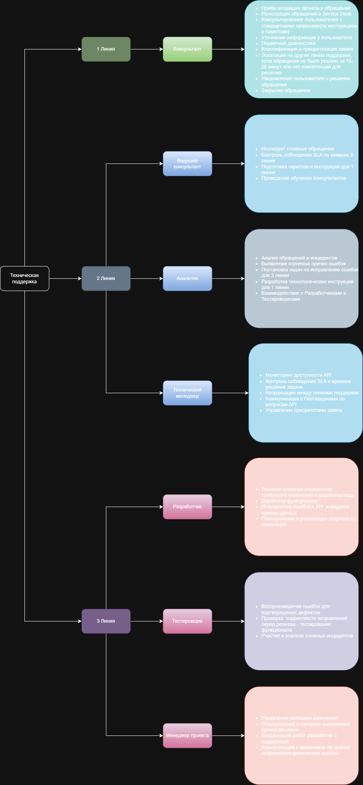
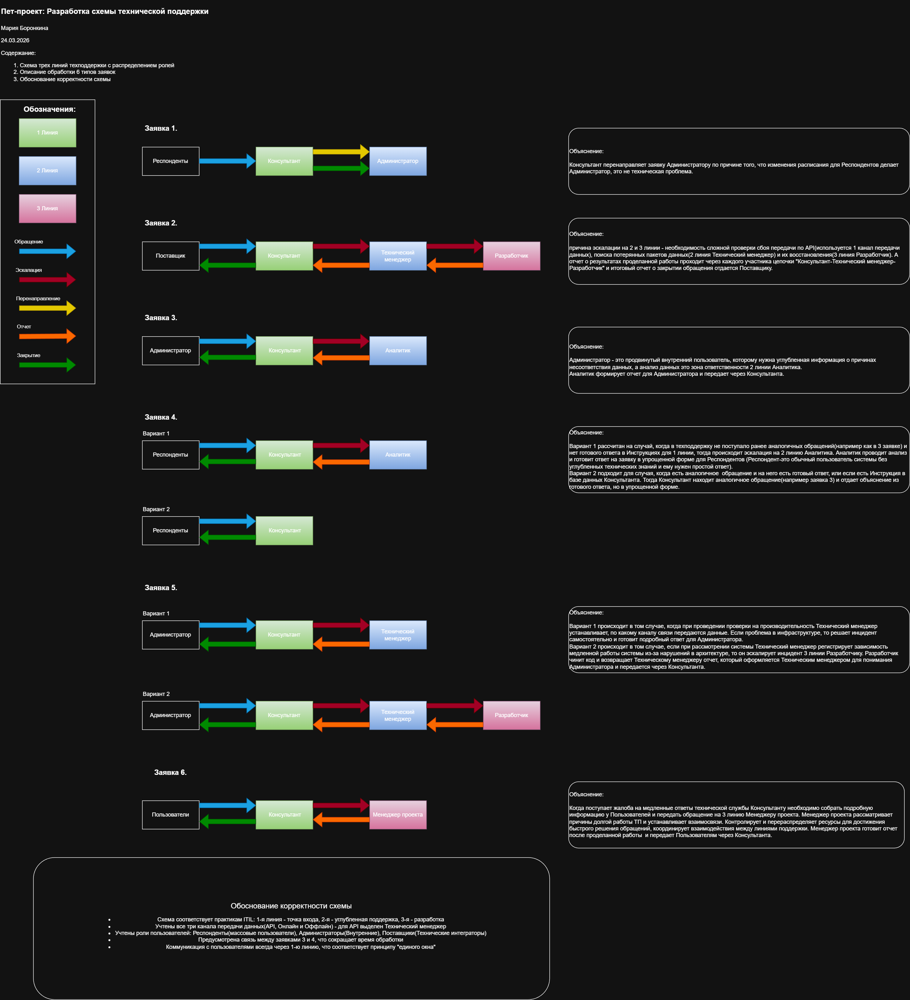

# Пет-проект: Разработка схемы технической поддержки

**Автор:** [Мария Боронкина]  
**Дата:** Март 2026  
**Инструменты:** Draw.io, ITIL, Markdown  

---

## 📌 Описание проекта

Разработка схемы технической поддержки для системы предоставления данных с тремя каналами передачи и тремя категориями пользователей.

### Объект поддержки
- **Канал 1:** API (для поставщиков сервиса)
- **Канал 2:** Онлайн-ввод данных (для респондентов)
- **Канал 3:** Оффлайн-ввод с отправкой при наличии интернета

### Пользователи
- **Респонденты** — предоставляют данные
- **Администраторы** — управляют сроками и контролируют сбор
- **Поставщики** — передают данные через API

---

## 🏗️ Схема технической поддержки

*Схема: три линии поддержки с распределением ролей и обработкой 6 типов заявок*

---

## 👥 Распределение ролей по линиям

| Линия | Специалисты | Основные функции |
|-------|-------------|------------------|
| **1-я линия (Service Desk)** | Консультант | Прием обращений, регистрация, первичная диагностика, решение типовых вопросов, эскалация |
| **2-я линия (Углубленная поддержка)** | Ведущий консультант, Аналитик, Технический менеджер | Диагностика инцидентов, анализ данных, мониторинг API, контроль SLA, наставничество |
| **3-я линия (Разработка)** | Разработчик, Тестировщик, Менеджер проекта | Исправление багов, доработка кода, восстановление данных, управление изменениями |

---

## 📊 Обработка 6 типов заявок

*Схема: маршрутизация и обработка 6 типов обращений*

### Заявка №1. Респонденты просят изменить расписание

| Параметр | Значение |
|----------|---------|
| **Тип** | Запрос на обслуживание |
| **Приоритет** | Низкий |
| **Обработка** | Консультант перенаправляет заявку Администратору (вопрос не в компетенции ТП) |

---

### Заявка №2. Поставщики сообщают о недоступности API

| Параметр | Значение |
|----------|---------|
| **Тип** | Инцидент |
| **Приоритет** | Высокий |
| **Канал передачи** | Канал 1 (API) |

**Обработка:**
1. **1-я линия:** Консультант регистрирует заявку, фиксирует детали, эскалирует
2. **2-я линия:** Технический менеджер проверяет логи API-шлюза, выявляет причину
3. **3-я линия:** Разработчик восстанавливает потерянные пакеты, исправляет код
4. Ответ Поставщику передается через Консультанта

---

### Заявка №3. Администраторы просят разъяснить причину уведомлений

| Параметр | Значение |
|----------|---------|
| **Тип** | Запрос на обслуживание (информационный) |
| **Приоритет** | Средний |

**Обработка:**
- Консультант эскалирует Аналитику (2 линия)
- Аналитик анализирует данные и правила валидации
- Ответ передается Администратору через Консультанта

---

### Заявка №4. Респонденты просят разъяснить причину уведомлений

| Параметр | Значение |
|----------|---------|
| **Тип** | Запрос на обслуживание |
| **Приоритет** | Низкий |

**Два варианта обработки:**

| Вариант | Условие | Действие |
|---------|---------|----------|
| **Вариант 1** | Нет аналогичных обращений | Эскалация Аналитику → анализ данных → ответ простым языком |
| **Вариант 2** | Есть ответ по заявке №3 | Консультант использует готовый ответ, адаптируя его для Респондента |

---

### Заявка №5. Администраторы жалуются на медленную работу системы

| Параметр | Значение |
|----------|---------|
| **Тип** | Инцидент (производительность) |
| **Приоритет** | Высокий |

**Два варианта обработки:**

| Вариант | Условие | Действие |
|---------|---------|----------|
| **Вариант 1** | Проблема в инфраструктуре | Технический менеджер решает самостоятельно (масштабирование, настройка) |
| **Вариант 2** | Проблема в коде/архитектуре | Эскалация Разработчику → оптимизация кода → проверка Тестировщиком |

**Диагностика:** Технический менеджер проверяет все три канала передачи данных (API, Онлайн, Оффлайн)

---

### Заявка №6. Жалоба на медленные ответы поддержки

| Параметр | Значение |
|----------|---------|
| **Тип** | Жалоба |
| **Приоритет** | Средний |

**Обработка:**
- Консультант эскалирует Менеджеру проекта (3 линия)
- Менеджер проекта анализирует SLA, загрузку линий, выявляет причины
- Принимает управленческие решения (расширение штата, корректировка SLA, оптимизация процессов)
- Ответ пользователю передается через Консультанта

---

## ✅ Обоснование корректности схемы

1. **Соответствие ITIL** — 1-я линия — точка входа, 2-я — углубленная поддержка, 3-я — разработка
2. **Учет трех каналов передачи данных** — для API выделен Технический менеджер (мониторинг доступности), для Онлайн и Оффлайн — Консультанты и Аналитики
3. **Учет ролей пользователей** — Респонденты (массовые пользователи), Администраторы (внутренние), Поставщики (технические интеграторы)
4. **Связь между заявками** — ответ по заявке №3 используется для обработки заявки №4, что сокращает время решения
5. **Принцип «единого окна»** — вся коммуникация с пользователями идет через 1-ю линию

---

## 🛠️ Инструменты

- **Draw.io** — создание блок-схемы
- **Markdown** — оформление документации
- **ITIL** — методологическая основа

---

## 📎 Ссылки

- [Исходник схемы (draw.io)](./tech-support-scheme.drawio)
- [PDF-версия для печати](./tech-support-scheme.pdf)

---

© 2026 | Пет-проект по разработке схемы технической поддержки
